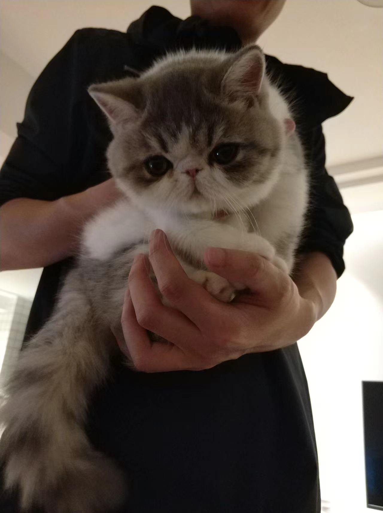

### Hi there 👋

<!--
**xpzouying/xpzouying** is a ✨ _special_ ✨ repository because its `README.md` (this file) appears on your GitHub profile.

Here are some ideas to get you started:

- 🔭 I’m currently working on ...
- 🌱 I’m currently learning ...
- 👯 I’m looking to collaborate on ...
- 🤔 I’m looking for help with ...
- 💬 Ask me about ...
- 📫 How to reach me: ...
- 😄 Pronouns: ...
- ⚡ Fun fact: ...
-->

Hey, this is Zou-Ying |
<blink>|</blink>

- 🆓 I try my best to live free.
- 😄 I try my best to live happily.
- 💪 I try my best to learn and practice.
- 🐈 I'm living with [my cats](https://zouying.world/).
- 💻 I write random notes about [my life](https://zouying.world/).

> 我们都生活在阴沟里，但仍有人仰望星空。
>
> We are all in the gutter, but some of us are looking at the stars.

 

### Personal Stats

  
